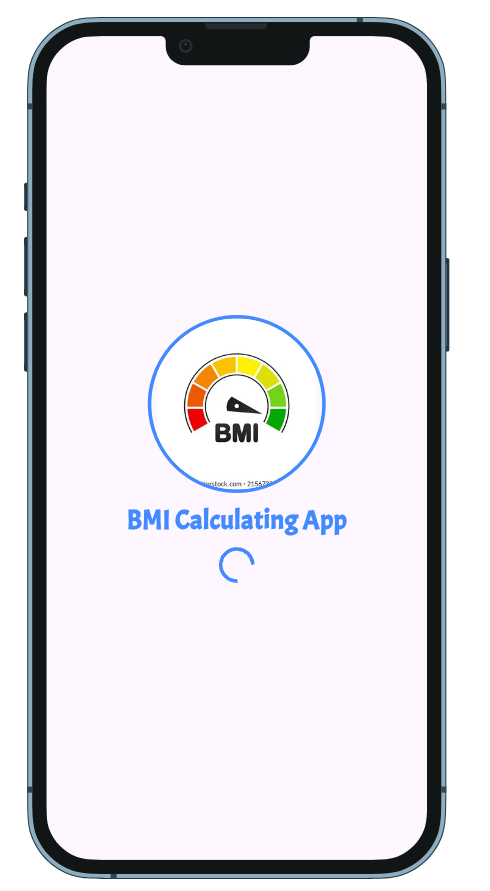
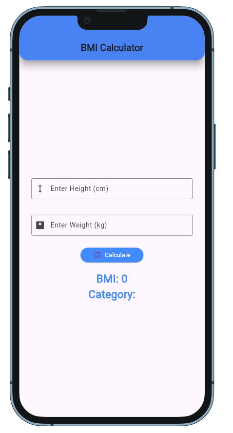

# **BMI Calculator App**

A **Flutter-based** mobile application that allows users to calculate their **Body Mass Index (BMI)** easily. The app provides instant feedback on BMI results and categorizes weight status (Underweight, Normal, Overweight, or Obese) with a modern and interactive UI.

# **📸 Screenshots**

## **🏁 Splash Screen**


## **🏡 BMI Calculating Page**


## **📊 BMI Result**


# ✨ **Features**

- 📏 **Enter Height (cm) and Weight (kg)**
- 🔢 **Instant BMI Calculation**
- 🎨 **Modern & Interactive UI**
- ⚡ **State Management using GetX**
- 📣 **Snackbar for error handling**
- 🌙 **Smooth User Experience**

# 🚀 **Live Demo**
🔗 [**Click Here to Try the Live Demo**](https://faysalcsecu.github.io/Flutter_BMI_Calculating_App/)

# 🛠️ **Installation**

### **1️⃣ Clone the Repository**
```sh
git clone https://github.com/yourusername/bmi-calculator.git
cd bmi-calculator
```

### **2️⃣ Install Dependencies**
```sh
flutter pub get
```

### **3️⃣ Run the App**
```sh
flutter run
```

# 📦 **Dependencies**
Ensure your `pubspec.yaml` includes the following dependencies:
```yaml
dependencies:
  flutter:
    sdk: flutter
device_preview: ^1.2.0
google_fonts: ^6.2.1
get: ^4.7.2
```

# 👤 **Author**

**Your Name**  
📧 Email: faysalf716@gmail.com
🔗 GitHub: [My GitHub Profile](https://github.com/faysalcsecu)  
🔗 LinkedIn: [My LinkedIn Profile](https://www.linkedin.com/in/faysal-bin-alauddin-4815a92a7/)


💡 **Developed with Flutter by Faysal Bin Alauddin**
